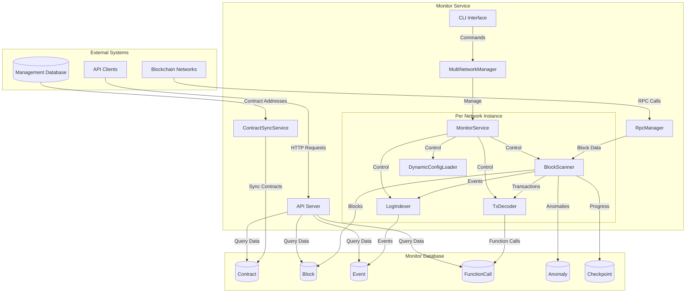
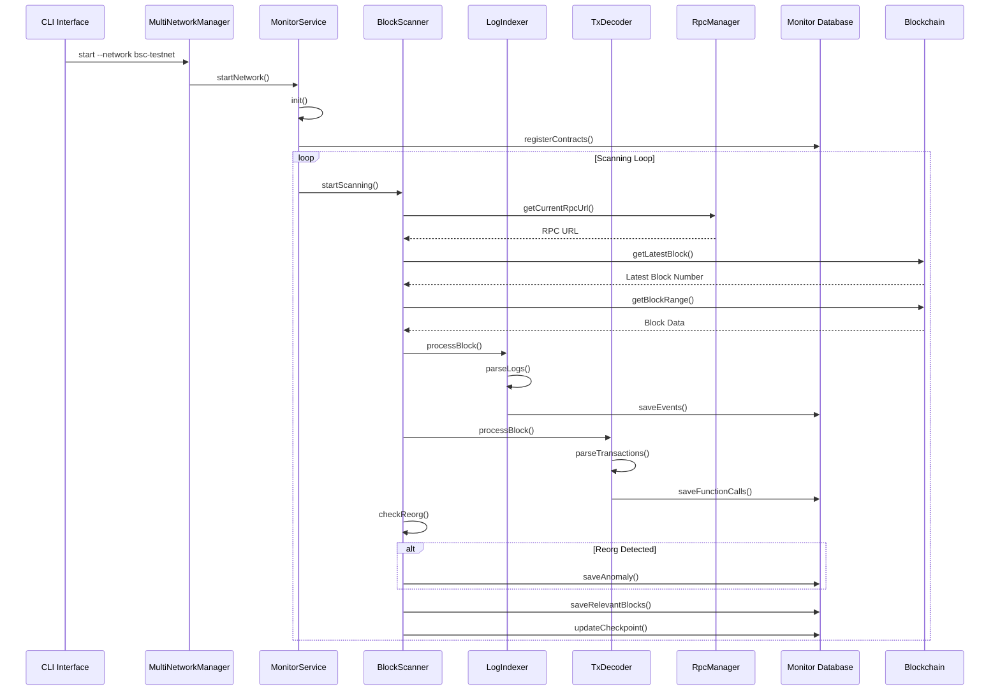
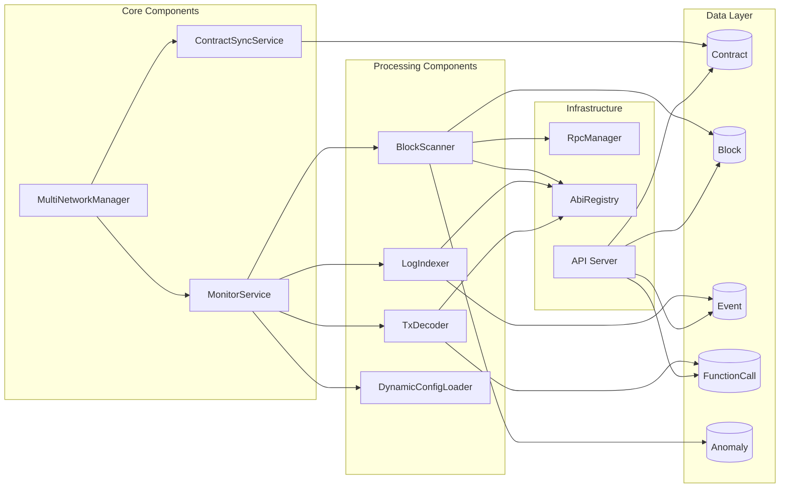
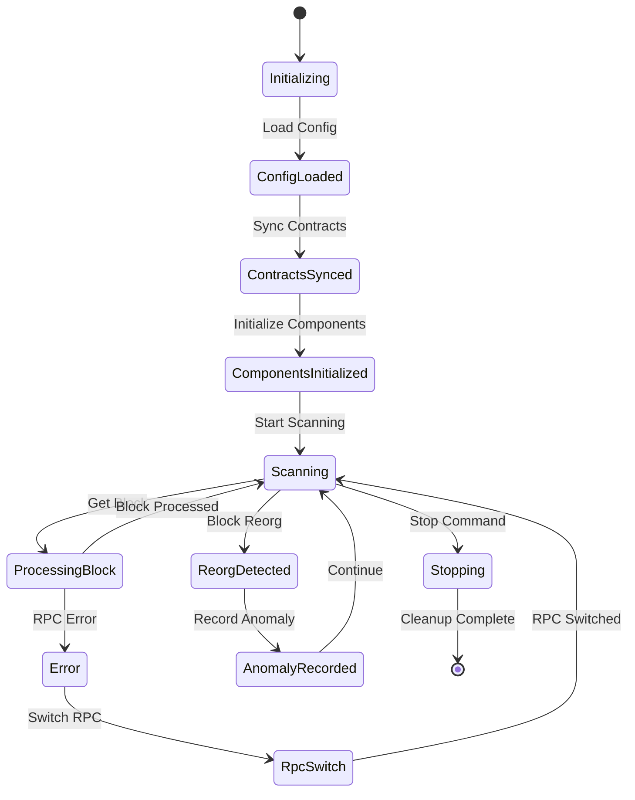
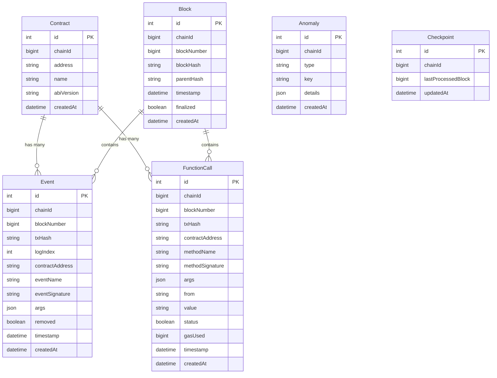

# Monitor Service 架构图

## 系统整体架构

```mermaid
graph TB
    subgraph "External Systems"
        MGMT_DB[(Management Database)]
        BLOCKCHAIN[Blockchain Networks]
        API_CLIENT[API Clients]
    end
    
    subgraph "Monitor Service"
        CLI[CLI Interface]
        MGR[MultiNetworkManager]
        
        subgraph "Per Network Instance"
            MS[MonitorService]
            BS[BlockScanner]
            LI[LogIndexer]
            TD[TxDecoder]
            DCL[DynamicConfigLoader]
        end
        
        CS[ContractSyncService]
        RM[RpcManager]
        API[API Server]
    end
    
    subgraph "Monitor Database"
        CONTRACT[(Contract)]
        BLOCK[(Block)]
        EVENT[(Event)]
        CALL[(FunctionCall)]
        ANOMALY[(Anomaly)]
        CHECKPOINT[(Checkpoint)]
    end
    
    MGMT_DB -->|Contract Addresses| CS
    CS -->|Sync Contracts| CONTRACT
    
    BLOCKCHAIN -->|RPC Calls| RM
    RM -->|Block Data| BS
    BS -->|Blocks| BLOCK
    BS -->|Events| LI
    BS -->|Transactions| TD
    
    LI -->|Events| EVENT
    TD -->|Function Calls| CALL
    
    BS -->|Anomalies| ANOMALY
    BS -->|Progress| CHECKPOINT
    
    CLI -->|Commands| MGR
    MGR -->|Manage| MS
    MS -->|Control| BS
    MS -->|Control| LI
    MS -->|Control| TD
    MS -->|Control| DCL
    
    API_CLIENT -->|HTTP Requests| API
    API -->|Query Data| CONTRACT
    API -->|Query Data| BLOCK
    API -->|Query Data| EVENT
    API -->|Query Data| CALL
```

## 数据流图

```mermaid
sequenceDiagram
    participant CLI as CLI Interface
    participant MGR as MultiNetworkManager
    participant MS as MonitorService
    participant BS as BlockScanner
    participant LI as LogIndexer
    participant TD as TxDecoder
    participant RM as RpcManager
    participant DB as Monitor Database
    participant BC as Blockchain

    CLI->>MGR: start --network bsc-testnet
    MGR->>MS: startNetwork()
    MS->>MS: init()
    MS->>DB: registerContracts()
    
    loop Scanning Loop
        MS->>BS: startScanning()
        BS->>RM: getCurrentRpcUrl()
        RM-->>BS: RPC URL
        BS->>BC: getLatestBlock()
        BC-->>BS: Latest Block Number
        
        BS->>BC: getBlockRange()
        BC-->>BS: Block Data
        
        BS->>LI: processBlock()
        LI->>LI: parseLogs()
        LI->>DB: saveEvents()
        
        BS->>TD: processBlock()
        TD->>TD: parseTransactions()
        TD->>DB: saveFunctionCalls()
        
        BS->>BS: checkReorg()
        alt Reorg Detected
            BS->>DB: saveAnomaly()
        end
        
        BS->>DB: saveRelevantBlocks()
        BS->>DB: updateCheckpoint()
    end
```

## 组件关系图

```mermaid
graph LR
    subgraph "Core Components"
        MGR[MultiNetworkManager]
        MS[MonitorService]
        CS[ContractSyncService]
    end
    
    subgraph "Processing Components"
        BS[BlockScanner]
        LI[LogIndexer]
        TD[TxDecoder]
        DCL[DynamicConfigLoader]
    end
    
    subgraph "Infrastructure"
        RM[RpcManager]
        AR[AbiRegistry]
        API[API Server]
    end
    
    subgraph "Data Layer"
        CONTRACT[(Contract)]
        BLOCK[(Block)]
        EVENT[(Event)]
        CALL[(FunctionCall)]
        ANOMALY[(Anomaly)]
    end
    
    MGR --> MS
    MGR --> CS
    MS --> BS
    MS --> LI
    MS --> TD
    MS --> DCL
    
    BS --> RM
    BS --> AR
    LI --> AR
    TD --> AR
    
    BS --> BLOCK
    BS --> ANOMALY
    LI --> EVENT
    TD --> CALL
    
    CS --> CONTRACT
    API --> CONTRACT
    API --> BLOCK
    API --> EVENT
    API --> CALL
```

## 状态机图

```mermaid
stateDiagram-v2
    [*] --> Initializing
    Initializing --> ConfigLoaded: Load Config
    ConfigLoaded --> ContractsSynced: Sync Contracts
    ContractsSynced --> ComponentsInitialized: Initialize Components
    ComponentsInitialized --> Scanning: Start Scanning
    
    Scanning --> ProcessingBlock: Get Block
    ProcessingBlock --> Scanning: Block Processed
    ProcessingBlock --> Error: RPC Error
    Error --> RpcSwitch: Switch RPC
    RpcSwitch --> Scanning: RPC Switched
    
    Scanning --> ReorgDetected: Block Reorg
    ReorgDetected --> AnomalyRecorded: Record Anomaly
    AnomalyRecorded --> Scanning: Continue
    
    Scanning --> Stopping: Stop Command
    Stopping --> [*]: Cleanup Complete
```

## 数据库关系图

```mermaid
erDiagram
    Contract ||--o{ Event : "has many"
    Contract ||--o{ FunctionCall : "has many"
    Block ||--o{ Event : "contains"
    Block ||--o{ FunctionCall : "contains"
    
    Contract {
        int id PK
        bigint chainId
        string address
        string name
        string abiVersion
        datetime createdAt
    }
    
    Block {
        int id PK
        bigint chainId
        bigint blockNumber
        string blockHash
        string parentHash
        datetime timestamp
        boolean finalized
        datetime createdAt
    }
    
    Event {
        int id PK
        bigint chainId
        bigint blockNumber
        string txHash
        int logIndex
        string contractAddress
        string eventName
        string eventSignature
        json args
        boolean removed
        datetime timestamp
        datetime createdAt
    }
    
    FunctionCall {
        int id PK
        bigint chainId
        bigint blockNumber
        string txHash
        string contractAddress
        string methodName
        string methodSignature
        json args
        string from
        string value
        boolean status
        bigint gasUsed
        datetime timestamp
        datetime createdAt
    }
    
    Anomaly {
        int id PK
        bigint chainId
        string type
        string key
        json details
        datetime createdAt
    }
    
    Checkpoint {
        int id PK
        bigint chainId
        bigint lastProcessedBlock
        datetime updatedAt
    }
```
